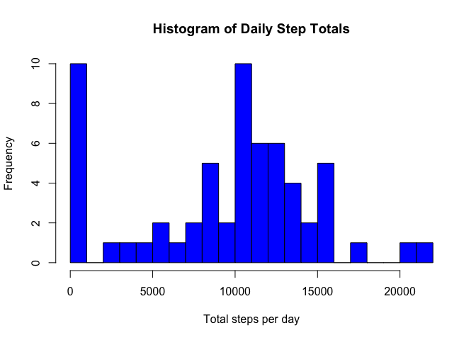

# Reproducible Research: Peer Assessment 1

## Introduction 
[(Source)](https://www.coursera.org/learn/reproducible-research/peer/gYyPt/course-project-1)
This assignment makes use of data from a personal activity monitoring device. This device collects data at 5 minute intervals through out the day. The data consists of two months of data from an anonymous individual collected during the months of October and November, 2012 and include the number of steps taken in 5 minute intervals each day.

## Loading and preprocessing the data
Unzip the file "activity.zip" and read the data file "activity.csv".

```r
activdat <- read.csv(unz("activity.zip","activity.csv"))
```
Now take a look at what we're dealing with so we know how best to clean.

```r
summary(activdat)
```

```
##      steps                date          interval     
##  Min.   :  0.00   2012-10-01:  288   Min.   :   0.0  
##  1st Qu.:  0.00   2012-10-02:  288   1st Qu.: 588.8  
##  Median :  0.00   2012-10-03:  288   Median :1177.5  
##  Mean   : 37.38   2012-10-04:  288   Mean   :1177.5  
##  3rd Qu.: 12.00   2012-10-05:  288   3rd Qu.:1766.2  
##  Max.   :806.00   2012-10-06:  288   Max.   :2355.0  
##  NA's   :2304     (Other)   :15840
```

```r
str(activdat)
```

```
## 'data.frame':	17568 obs. of  3 variables:
##  $ steps   : int  NA NA NA NA NA NA NA NA NA NA ...
##  $ date    : Factor w/ 61 levels "2012-10-01","2012-10-02",..: 1 1 1 1 1 1 1 1 1 1 ...
##  $ interval: int  0 5 10 15 20 25 30 35 40 45 ...
```
So we see 17568 observations of 3 variables in the dataset with 2304 NAs in the **steps** column and the **interval** values appear as a varied length integer representing minutes (and generally hours) after midnight. For ease of further analysis we will clean the data set by converting the **interval** column to a **time** character variable and combine with the **date** variable to form a new variable **datetime** which will be compared with **steps**.

```r
library(lubridate)
library(dplyr)
```


```r
activdat$time <- sprintf("%04d",activdat$interval) 
activdat$time <- activdat$time %>%
        sub("([0-9]{2})([0-9]{2})","\\1:\\2",.,perl=TRUE)
activdat$datetime <- activdat$time %>% 
    paste(activdat$date,.,sep=" ") %>% ymd_hm
data <-select(activdat, time, datetime, steps)
summary(data)
```

```
##      time              datetime                       steps       
##  Length:17568       Min.   :2012-10-01 00:00:00   Min.   :  0.00  
##  Class :character   1st Qu.:2012-10-16 05:58:45   1st Qu.:  0.00  
##  Mode  :character   Median :2012-10-31 11:57:30   Median :  0.00  
##                     Mean   :2012-10-31 11:57:30   Mean   : 37.38  
##                     3rd Qu.:2012-11-15 17:56:15   3rd Qu.: 12.00  
##                     Max.   :2012-11-30 23:55:00   Max.   :806.00  
##                                                   NA's   :2304
```


## What is the mean total number of steps taken per day?
We'll initially assume that NA values can be ignored for this part. 

```r
dailysteptotals <- tapply(data$steps,date(data$datetime),sum,na.rm=TRUE)
range(dailysteptotals)
```

```
## [1]     0 21194
```

We see the values for **dailysteptotals** lie between 0 and 22000 so when creating a histogram we'll use 22 breaks (one for every 1000 steps).

```r
hist(dailysteptotals, breaks = 22, col = "blue", xlab = "Total steps per day", main = "Histogram of Daily Step Totals")
```

<!-- -->

From the histogram we can see that there are 10 days with an unusuallly low (<1000) total daily steps but is this due to low values or a result of NAs being removed? If from the earlier summary we note that there are 2304 NAs in the dataset and each day has 288 readings, we can check the distribution of the NAs:

```r
nas <- tapply(data$steps,date(data$datetime),function(x) sum(is.na(x)))
# how many days have all NA values?
sum(nas %in% 288)
```

```
## [1] 8
```

```r
# how many days have between 0 and 288 NA values?
sum(nas > 0 & nas < 288)
```

```
## [1] 0
```
So we see that there are 8 days where all values are NA and no days where some values are NA. This suggests that these 8 "NA" days should be discounted from the dataset when determining medians, means, etc. giving the resulting histogram and values:

```r
baddays <- nas==288
hist(dailysteptotals[!baddays], breaks = 22, col = "blue", xlab = "Total steps per day", main = "Histogram of Daily Step Totals")
```

<!-- -->

```r
mn <- mean(dailysteptotals[!baddays])
mn
```

```
## [1] 10766.19
```

```r
md <- median(dailysteptotals[!baddays])
md
```

```
## [1] 10765
```

This shows us the actual mean to be 10766.19 steps and  the actual median of the total recorded steps per day to be 10765 steps. 

## What is the average daily activity pattern?
We'll group the **steps** by the **time** interval and calculate the means, removing any NA values.

```r
perday <- tapply(data$steps, data$time, mean, na.rm=TRUE)
highest <- data$time[1:288][perday==max(perday)]
plot(as.POSIXct(data$datetime, format = "%H:%M")[1:288] , perday, type = "l", main = "Time Series of Average Steps Taken per Interval", ylab= "Average steps per 5 minutes", xlab = "Time of the Day", xaxs='r')
points(as.POSIXct(data$datetime, format = "%H:%M")[1:288][perday==max(perday)], max(perday), pch=19, col="red")
text(as.POSIXct(data$datetime, format = "%H:%M")[105], 206, "Max @ (8:35, 206.17)", pos =4, cex=0.8)
```

<!-- -->

From the time series we can see that the **interval** with the highest number of **steps** begins at 08:35 with a value of 206.17 steps.

## Imputing missing values
From our earlier observation of the NA values we found the total number of NAs came from 8 days of missing data:

```r
missingdates <- unique(date(data$datetime))[nas %in% 288]
missingdates
```

```
## [1] "2012-10-01" "2012-10-08" "2012-11-01" "2012-11-04" "2012-11-09"
## [6] "2012-11-10" "2012-11-14" "2012-11-30"
```

```r
weekdays(missingdates)
```

```
## [1] "Monday"    "Monday"    "Thursday"  "Sunday"    "Friday"    "Saturday" 
## [7] "Wednesday" "Friday"
```
Multiplying the 8 days by the 288 observations per day gives us the 2304 NA values that were described in the initial summary of the **activity.csv** table. We will look to impute these missing values by replacing with averages for each interval based on the weekday. Note that Tuesdays have no missing values so will not be calculated.

```r
data$day <- weekdays(data$datetime)
mondat <- tapply(data$steps[data$day=="Monday"], data$time[data$day=="Monday"], mean, na.rm=TRUE)
weddat <- tapply(data$steps[data$day=="Wednesday"], data$time[data$day=="Wednesday"], mean, na.rm=TRUE)
thudat <- tapply(data$steps[data$day=="Thursday"], data$time[data$day=="Thursday"], mean, na.rm=TRUE)
fridat <- tapply(data$steps[data$day=="Friday"], data$time[data$day=="Friday"], mean, na.rm=TRUE)
satdat <- tapply(data$steps[data$day=="Saturday"], data$time[data$day=="Saturday"], mean, na.rm=TRUE)
sundat <- tapply(data$steps[data$day=="Sunday"], data$time[data$day=="Sunday"], mean, na.rm=TRUE)
newdata <- data
newdata$steps[date(data$datetime)=="2012-10-01"|date(data$datetime)=="2012-10-08"]<-mondat
newdata$steps[date(data$datetime)=="2012-11-01"]<-thudat 
newdata$steps[date(data$datetime)=="2012-11-04"]<-sundat
newdata$steps[date(data$datetime)=="2012-11-09"|date(data$datetime)=="2012-11-30"]<-fridat
newdata$steps[date(data$datetime)=="2012-11-10"]<-satdat
newdata$steps[date(data$datetime)=="2012-11-14"]<-weddat
sum(is.na(newdata$steps))
```

```
## [1] 0
```

So there are now no NA values in the **newdata** dataset. Let's look at the changes to the histogram, mean, and median of daily step totals, now that the missing values have been replaced with imputed values. 

```r
dailysteptotals2 <- tapply(newdata$steps,date(newdata$datetime),sum)
hist(dailysteptotals2, breaks = 22, col = "lightblue", xlab = "Total steps per day", main = "Histogram with Imputed values compared with Original")
hist(dailysteptotals[!baddays], breaks = 22, col = "blue", add=TRUE)
legend("topright",c("Original", "Updated"), fill = c("blue","lightblue"))
```

<!-- -->

```r
# Calculate the new mean and compare with the old mean
mn2 <- mean(dailysteptotals2)
mn2-mn
```

```
## [1] 55.02092
```

```r
# Calculate the new median and compare with the old median
md2 <- median(dailysteptotals2)
md2-md
```

```
## [1] 250
```
So the mean of the **newdata** daily step totals is 10821.21, which is 55.02 steps higher than the original mean and the median is now 11015, which is   250 steps higher than the original data. So the effect of imputing values was quite significant on the daily total distribution as it gave weight to days that would either be lumped into the lowest bin (if you discounted NA values but still took the sums for the day (see first histogram)) or would not contribute at all (if you only represented recorded data as in the second histogram). Though on the grand scale of the data you can see that it only counts for a 0.51% change in the mean.

## Are there differences in activity patterns between weekdays and weekends?
We will allocate the **daytype** variable to determine whether an observation occurs on a weekday or on the weekend then aggregate the means for each interval separately for each **daytype** value. As the time intervals are continuous and circular, we will repeat the first value of each subset and allocate to 24:00 so that the span of the data includes the full 24hr period (lines are between two points so you need to create the line between 23:55 and 00:00/24:00 to encompass the full day).

```r
# Create variable for day type
newdata$daytype[newdata$day=="Saturday"|newdata$day=="Sunday"] <- "weekend"
newdata$daytype[!newdata$day=="Saturday" & !newdata$day=="Sunday"] <- "weekday"
# Find mean steps per interval by daytype
wkd <- filter(newdata, daytype=="weekday")
wkend <- filter(newdata, daytype=="weekend")
perwkd <- tapply(wkd$steps, wkd$time, mean)
perwkend <- tapply(wkend$steps, wkend$time, mean)
# Create dataset to allow smooth plotting of the timeseries data
plotdat <- data.frame(time=rep(c(activdat$interval[1:288],2400),2),steps=c(perwkd,perwkd[[1]],perwkend,perwkend[[1]]), type=c(rep("Weekday",289),rep("Weekend",289)))
library(lattice)
p <- xyplot(steps ~ time | as.factor(type), data = plotdat, type = "l", layout = c(1,2), main="Time Series of Average Steps per Time Interval", xlab = "Time of the Day", ylab = "Number of Steps Taken", xlim=c(0,2400), scales = list(x=list(at=c(0,400,800,1200,1600,2000,2400),labels=c("00:00","04:00","08:00","12:00","16:00","20:00","24:00"))))
print(p)
```

<!-- -->

From the plots we can see that weekday activity starts around the 5am mark whilst on the weekend it doesn't begin until around 7:30am. Weekdays also show a major spike from 8-9am followed by some minor spikes (~50-100 steps) around midday, 3:30pm, 5pm and 6:30pm. Weekends on the otherhand have a smaller maximum but seem to be more active (~50-150 steps) for a longer period. This could suggest that the participant works/studies Monday-Friday in a position that is primarily sedentary, increasing activity only for lunch, afternoon tea, home time, and dinner, though is relatively consistently mobile on weekends from about 7:30am until about 9:00pm.
